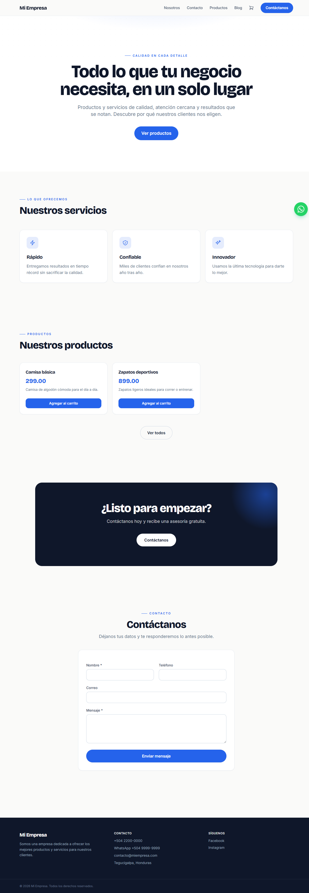
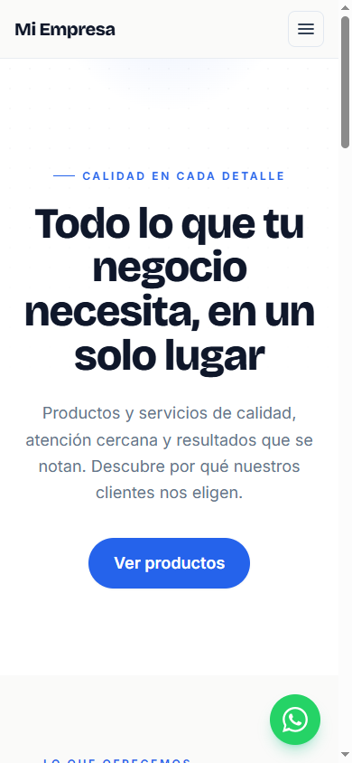
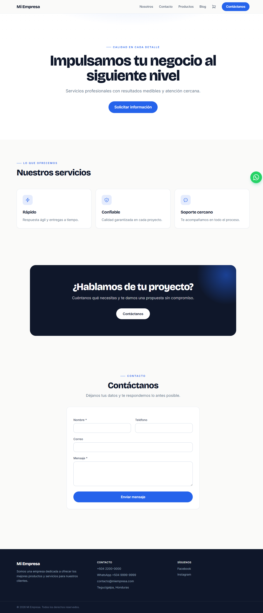

# CMS Starter — Laravel 12 + Filament


Un **CMS a medida, sin límites de plantilla**, pensado para agencias y freelancers que
construyen muchos sitios administrables. En lugar de instalar plugins, **creas tus propios
módulos de contenido desde el panel** (como los Custom Post Types de WordPress, pero de
verdad no-code) y **activas solo las funciones que cada cliente necesita** (tienda,
multilenguaje, newsletter, reservas…). Cada cliente es una instalación independiente que se
genera en segundos.

<p align="center">
  
</p>

---

## Contenido

- [Características](#características)
- [Módulos vs. Funciones](#módulos-vs-funciones)
- [Capturas](#capturas)
- [Stack](#stack)
- [Requisitos](#requisitos)
- [Instalación](#instalación)
- [Un sitio nuevo por cliente](#un-sitio-nuevo-por-cliente-windows--laragon)
- [Despliegue en cPanel](#despliegue-en-hosting-compartido-cpanel)
- [Configuración (panel)](#configuración-desde-el-panel)
- [API / Headless](#api--headless)
- [Pagos: Stripe](#pagos-con-stripe) · [PayPal](#pagos-con-paypal)
- [Seguridad y 2FA](#seguridad)
- [Pruebas y CI](#pruebas-y-ci)
- [Contribuir](#contribuir)
- [Créditos](#créditos) · [Licencia](#licencia)

---

## Características

### Motor de contenido no-code
- **Módulos dinámicos**: creas tipos de contenido (Productos, Propiedades, Doctores, Cursos…)
  desde el panel, defines sus campos y el CRUD se genera solo. Aparecen automáticamente en el
  menú del administrador.
- **Tipos de campo**: texto, texto largo, editor con formato, correo, número/precio, sí/no,
  fecha, lista de opciones, imagen, galería y **relación a otro módulo** (CMS relacional).
- **Constructor de páginas por bloques**: Hero, servicios, galería, imagen+texto, CTA,
  testimonios, precios, FAQ, mapa, video, estadísticas, formulario, listado de módulo y más.
- **Plantillas de página** listas para usar (landing, negocio local, tienda, "nosotros").

### Funciones del sitio (extensiones activables)
Cada capacidad con lógica propia se **prende o apaga** desde **Sistema → Funciones del sitio**.
Al activarse desbloquea su interfaz en el panel y sus bloques en el sitio:

| Función | Qué desbloquea |
|---|---|
| **Tienda** | Carrito, pagos, cupones, inventario, variantes, envíos y órdenes |
| **Multilenguaje** | Sitio en varios idiomas con URL por idioma y traducción de contenido |
| **Newsletter** | Captura de suscriptores y campañas por correo |
| **Reservas / Citas** | Agenda con horarios reales y aviso por correo |
| **Generador con IA** | Crea módulos y plantillas desde un prompt |

### Tienda (e-commerce)
- **Carrito** y **checkout** con **Stripe** y **PayPal** (hosteado y seguro), o **pedido por
  WhatsApp** como alternativa sin comisiones.
- **Cupones** de descuento (porcentaje o monto fijo) con vencimiento, compra mínima, límite de
  usos y **alcance por tienda** o globales.
- **Inventario (stock)** por producto, con aviso "Agotado" / "Solo quedan N" y descuento
  automático al confirmarse el pago.
- **Variantes** por producto (talla, color, plan…), cada una con su **precio y stock**.
- **Envíos**: tarifa plana con **envío gratis desde un umbral**, dirección en el checkout.
- **Estados de pedido**: pendiente → pagada → **enviada** → **entregada**, con aviso al cliente
  por correo en cada paso. Todas las órdenes quedan registradas en el panel.

### Multilenguaje
- URLs por idioma (**el idioma por defecto en la raíz** y `/en`, `/fr`… para el resto).
- Traduce **páginas, blog y ajustes** desde el panel; **selector de idioma**, `hreflang` y
  `canonical` por idioma para SEO.

### Newsletter
- Formulario de **suscripción** (bloque para páginas) con anti-spam, listado de **suscriptores**
  (con exportación CSV) y **campañas** que se envían por tus cuentas SMTP. Baja mediante enlace
  **firmado** por destinatario.

### Reservas / Citas
- Bloque de **reserva** con **horarios reales**: configuras días, apertura, cierre, duración del
  turno y cupos. El sitio ofrece solo los **horarios disponibles** y valida en el servidor para
  **evitar dobles reservas**. Agenda gestionable en el panel con aviso por correo al confirmar.

### Generación con IA
- Conectas **tu propia API** (OpenRouter — OpenAI, Gemini, Claude… — u OpenAI) y describes lo que
  quieres: la IA **genera el módulo o la plantilla** y lo instala. La llave se guarda
  **encriptada** y la respuesta se **valida y sanea** antes de crear nada.

### Gestión
- **Dashboard vivo**: tarjetas que aparecen según las funciones activas (ventas del mes, órdenes
  pendientes, reservas próximas, suscriptores, mensajes) más tablas de órdenes recientes y
  próximas reservas.
- **Asistente de primeros pasos**: checklist que guía al clonar un sitio nuevo y desaparece al
  completarse.
- **Biblioteca de medios**, **perfil de usuario** (nombre/correo/contraseña) y **cuentas SMTP**
  múltiples con contraseñas encriptadas y botón de prueba.
- **Roles**: Administrador (control total) y Editor (solo contenido).
- **Marca del cliente**: el sitio **y el panel** toman el nombre, logo, **favicon** y color de
  marca desde Ajustes.

### Frontend, SEO y analítica
- Diseño propio (**Bricolage Grotesque + Inter**, íconos SVG), **responsive** y re-tematizado al
  color de marca.
- `sitemap.xml` y `robots.txt` automáticos, **Open Graph + Twitter Cards**, `canonical` y
  **JSON-LD** (Organización + Artículo).
- **Analítica**: pega tus scripts de **GA4 / Meta Pixel / TikTok** y un **banner de cookies**
  opcional que **difiere el seguimiento hasta que el visitante acepta** (consentimiento).

### API / Headless
- API REST de solo lectura para apps móviles u otros frontends (Next.js, etc.), con
  autenticación por **API keys** gestionadas desde el panel.

### Packs (ecosistema)
- **Biblioteca de packs** de módulos y plantillas curados, instalables de un clic, y
  **exportación/importación** en `.json` portable (deja archivos en `resources/packs/`).

### Multi-cliente
- Script `nuevo-cliente.ps1` que **clona y configura** un sitio nuevo (base de datos, admin,
  contenido base) en segundos.

---

## Módulos vs. Funciones

Es la idea central del CMS y conviene tenerla clara:

- **Módulo = un TIPO DE CONTENIDO** que creas sin código (Productos, Servicios…). Define *qué*
  contenido maneja el sitio; puedes crear los que quieras.
- **Función = una CAPACIDAD con lógica** que se activa con un switch (Tienda, Multilenguaje…).
  Define *qué sabe hacer* el sitio.

Se conectan por el **tipo** del módulo: un módulo de tipo *tienda* es tu catálogo, y la **función
Tienda** es la que le da carrito, pagos, cupones e inventario. Otras funciones (Newsletter,
Reservas) son independientes y traen su propio contenido.

---

## Capturas

| Escritorio | Móvil | Desde plantilla |
|---|---|---|
|  |  |  |

---

## Stack

- **Laravel 12** (PHP 8.2+) · **Filament 3** (panel)
- **Blade + Tailwind CSS 4** (frontend, compilado con **Vite**)
- **MySQL** (producción) / **SQLite** (desarrollo)
- **Stripe** y **PayPal** (pagos) · **PHPUnit** + **GitHub Actions** (pruebas/CI)

---

## Requisitos

- **PHP 8.2 o superior** con extensiones: `mbstring`, `openssl`, `pdo`, `fileinfo`, `curl`,
  `gd`, `intl`, `bcmath`, `zip` (y `pdo_sqlite` para desarrollo o `pdo_mysql` para producción).
- **Composer 2**
- **Node.js 18+** y **npm** (solo para compilar los assets; no se necesita en el servidor)
- **MySQL 8** (producción) o **SQLite** (desarrollo)

---

## Instalación

```bash
git clone https://github.com/celvintr/CMS-Starter.git cms-starter
cd cms-starter
composer install
npm install
npm run build          # compila el CSS (Tailwind v4 + Vite)
cp .env.example .env
php artisan key:generate
php artisan migrate --seed --seeder=Database\\Seeders\\DemoContentSeeder
php artisan storage:link
php artisan serve
```

> Para desarrollar el frontend con recarga en vivo: `npm run dev` (en otra terminal).

- Sitio: `http://localhost:8000`
- Panel: `http://localhost:8000/admin`

Crea tu usuario administrador:

```bash
php artisan make:filament-user
```

> El seeder incluye un usuario editor de prueba: `editor@demo.com` / `editor123`.

---

## Un sitio nuevo por cliente (Windows / Laragon)

```powershell
.\nuevo-cliente.ps1 -Slug "farmacia-lopez" -Nombre "Farmacia Lopez" -Email "admin@farmacia.com"
```

Copia el proyecto, genera la base de datos con contenido base, enlaza storage y crea el
administrador. Al terminar muestra la URL y las credenciales.

---

## Despliegue en hosting compartido (cPanel)

1. **Compila los assets localmente** antes de subir: `npm run build` (genera `public/build`).
2. PHP 8.2+ en el selector de versión de PHP.
3. Base de datos MySQL y credenciales en `.env`.
4. Sube el proyecto **con la carpeta `public/build`** y apunta el dominio a `/public`.
5. `php artisan migrate --force && php artisan storage:link && php artisan config:cache`.
6. **No se necesita Node en el servidor**: Tailwind ya está compilado y Filament trae sus assets.

---

## Configuración (desde el panel)

Casi todo se maneja en **Ajustes del sitio** y en **Sistema → Funciones del sitio**:

- **Funciones del sitio** — activa/desactiva Tienda, Multilenguaje, Newsletter, Reservas e IA.
- **Identidad** — nombre, logo, **favicon**, colores de marca (re-tematiza sitio y panel).
- **Pagos** — Stripe y PayPal (ver abajo). **Envíos** — tarifa y envío gratis desde un umbral.
- **Idiomas y traducciones** — idioma por defecto e idiomas disponibles.
- **Analítica y cookies** — scripts de GA4/Meta/TikTok y banner de consentimiento.
- **Horarios de reservas** — días, apertura, cierre, duración del turno y cupos.
- **Notificaciones por correo** — cuentas SMTP y a quién avisar de formularios y órdenes.
- **SEO y pie de página**, **menú de navegación**, **redes sociales**.

---

## API / Headless

Genera una llave en **Ajustes → API keys** y consume el contenido con el header
`Authorization: Bearer <token>` (o `X-API-Key: <token>`):

```bash
curl -H "Authorization: Bearer TU_TOKEN" https://tudominio.com/api/pages
```

Endpoints (solo lectura): `/api/settings`, `/api/pages`, `/api/pages/{slug}`,
`/api/posts`, `/api/posts/{slug}`, `/api/modules`, `/api/modules/{slug}`,
`/api/modules/{slug}/entries`, `/api/modules/{slug}/entries/{entry}`.

Solo expone contenido publicado y ajustes públicos (nunca secretos). Rate-limit de 60 req/min.

## Pagos con Stripe

1. Crea una cuenta en [stripe.com](https://stripe.com) y copia tus llaves (modo prueba: `pk_test_…` / `sk_test_…`).
2. En el panel → **Ajustes del sitio → Pagos (Stripe)**: activa, pega las llaves y la moneda.
3. En Stripe → Developers → Webhooks, agrega el endpoint `https://tudominio.com/stripe/webhook`
   (evento `checkout.session.completed`) y pega el **secreto del webhook** (`whsec_…`) en Ajustes.
4. El botón **"Pagar con tarjeta"** aparece en el carrito; las órdenes llegan a **Órdenes**.

Los datos de tarjeta se procesan en la página segura de Stripe (checkout hosteado): **nunca tocan
tu servidor**. Los montos (con cupón y envío) se calculan en el servidor y el pago se confirma por
webhook firmado.

## Pagos con PayPal

1. En [developer.paypal.com](https://developer.paypal.com) crea una app y copia el **Client ID** y **Secret** (sandbox para pruebas).
2. En el panel → **Ajustes del sitio → Pagos (PayPal)**: activa, elige modo (sandbox/live) y pega las credenciales.
3. En el carrito aparece el botón **PayPal**; el cliente aprueba en PayPal y el pago se **captura**
   del lado del servidor, marcando la orden como pagada. Las credenciales se guardan **encriptadas**.

## Seguridad

Protecciones incluidas:

- **Verificación en dos pasos (2FA)** con app de autenticación (Google Authenticator, Authy…):
  opcional para cualquier usuario y **obligatoria para administradores**. Incluye **códigos de
  recuperación** y desafío en el inicio de sesión. Secretos y códigos **encriptados**.
- **Headers de seguridad** en todas las respuestas (X-Frame-Options, X-Content-Type-Options,
  Referrer-Policy, Permissions-Policy y HSTS bajo HTTPS).
- **Anti-spam**: honeypot en los formularios públicos + **rate-limit** por IP.
- **Subidas** limitadas a imágenes y tamaño máximo.
- **Secretos encriptados** (IA, Stripe, PayPal, SMTP, 2FA) en la base de datos.
- **Roles**: el cliente (Editor) no accede a módulos, ajustes ni usuarios.

Checklist antes de publicar en producción:

- [ ] `APP_ENV=production` y `APP_DEBUG=false`
- [ ] Servir por **HTTPS** (activa HSTS y cookies seguras)
- [ ] `SESSION_SECURE_COOKIE=true`
- [ ] Crear el administrador y **cambiar** cualquier contraseña de ejemplo
- [ ] `php artisan config:cache && php artisan route:cache`
- [ ] Mantener dependencias al día (`composer update`, `npm update`)

> ¿Encontraste una vulnerabilidad? **No abras un issue público** — sigue [SECURITY.md](SECURITY.md).

## Pruebas y CI

El proyecto incluye una **suite de pruebas** (PHPUnit) que cubre las rutas críticas: 2FA, cupones,
carrito (stock, variantes y envío), enrutado multilenguaje, acceso al panel y reservas.

```bash
php artisan test
```

Además, **GitHub Actions** (`.github/workflows/ci.yml`) corre la suite en **cada push y Pull
Request** a `main`, de modo que ningún cambio se integra sin quedar verificado. Puedes exigir el
check en la protección de rama del repositorio.

## Contribuir

¡Las contribuciones son bienvenidas! Este proyecto crece con la comunidad.

1. Haz un **fork** y crea una rama (`git checkout -b mi-mejora`).
2. Sigue el estilo del código existente (PSR-12) y **agrega/actualiza pruebas** para tu cambio.
3. Asegúrate de que `php artisan test` pase y abre un **Pull Request** describiendo qué cambia y por qué.

Lee la **[guía de contribución](CONTRIBUTING.md)** para los detalles.

> **Nota de seguridad:** la rama `main` está protegida y **cada Pull Request se revisa (y pasa la
> CI) antes de fusionarse** — ningún cambio entra sin revisión del mantenedor. No se aceptan PRs
> con secretos, binarios sospechosos ni dependencias sin justificar.

## Créditos

Construido sobre software libre increíble: [Laravel](https://laravel.com),
[Filament](https://filamentphp.com), [Tailwind CSS](https://tailwindcss.com),
[Livewire](https://livewire.laravel.com), [Stripe](https://stripe.com),
[PayPal](https://developer.paypal.com), [pragmarx/google2fa](https://github.com/antonioribeiro/google2fa)
y [BaconQrCode](https://github.com/Bacon/BaconQrCode).

Creado y mantenido por [@celvintr](https://github.com/celvintr). Si te sirve, deja una ⭐ y
ayúdanos a mejorarlo.

## Licencia

[MIT](LICENSE) — libre para usar, modificar y distribuir.
